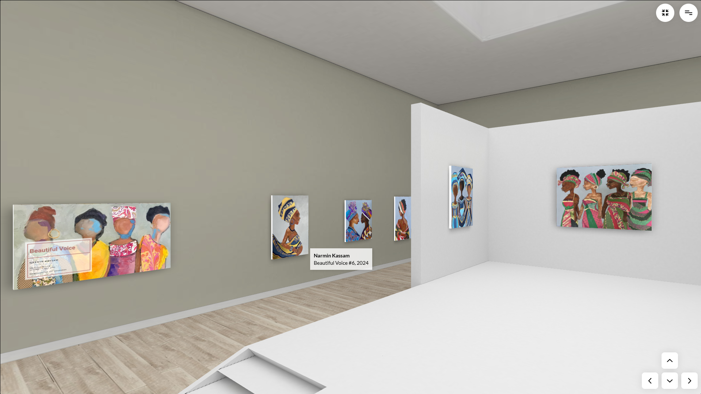
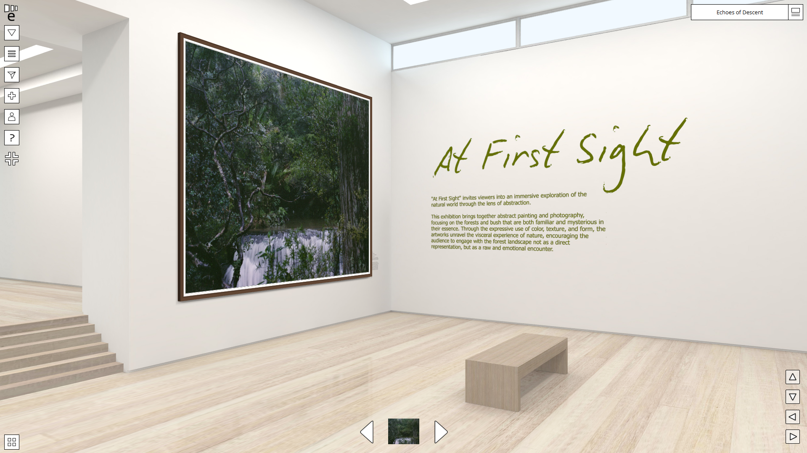
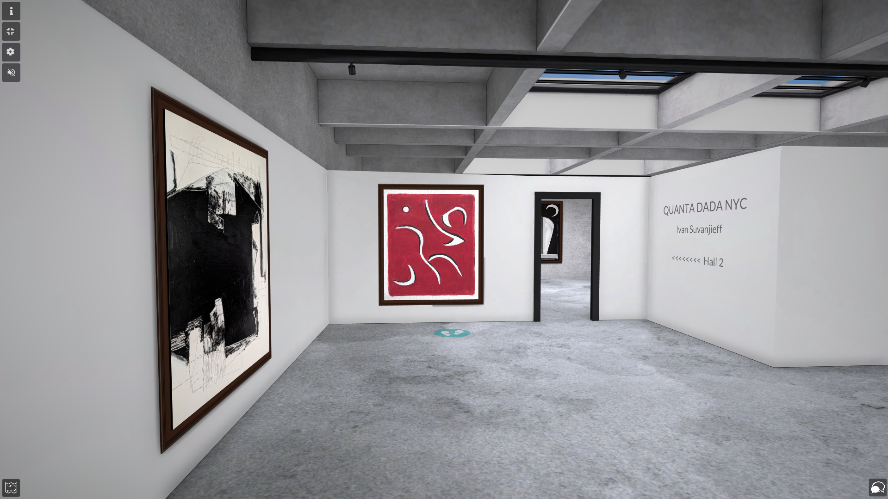
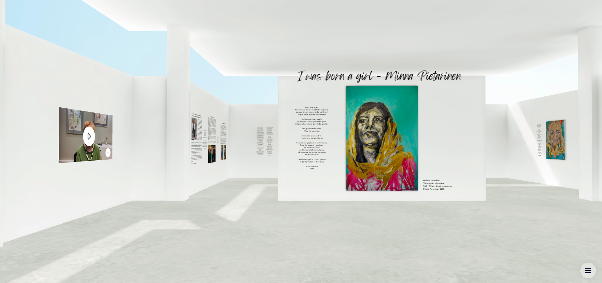

# Competitive Analysis: Virtual 3D Art Galleries

### Purpose  
To analyze existing virtual gallery platforms and identify their strengths and weaknesses in order to create a more user-friendly, aesthetic, and interactive experience.

---

### Laika Gallery  
  
**Link:** [Laika Gallery](https://laika.gallery/users/metmuseum/galleries/olive-trees-wheat-fields-and-sunflowers-1/)

**Strengths:**
- Clean white walls  
- High-quality textures  
- Charming and detailed entrance scene  
- Pleasant lighting in the entry area  
- Paintings can be enlarged with good clarity  

**Weaknesses:**
- Very unintuitive and uncomfortable controls on both desktop and mobile  
- Zooming in on paintings feels abrupt and lacks animation  
- Natural lighting in the exhibition space makes the room feel dim and basement-like  
- No ability to look upward  
- Camera rotation feels sluggish and imprecise  
- Navigation is limited to keyboard arrows  
- Fullscreen mode does not work on mobile despite the presence of the button  

---

### Kunstmatrix (Artspaces)  
  
**Link:** [Kunstmatrix](https://artspaces.kunstmatrix.com/en/exhibition/14496633/beautiful-voice)

**Strengths:**
- Paintings can be viewed in large format clearly  
- Easy navigation between artworks, similar to a slideshow  
- Uses artificial lighting, which enhances visibility  

**Weaknesses:**
- Walls are not white  
- Artworks are placed on uneven levels  
- Inconvenient movement controls  
- Poor lighting design; areas behind the platform are dark  
- Layout feels chaotic  
- Confusing floating balcony element  

---

### Exhibbit  
  
**Link:** [Exhibbit](https://publish.exhibbit.com/gallery/140943848/solo-gallery-7660/?reload=aHR0cHM6Ly9wdWJsaXNoLmV4aGliYml0LmNvbS9kZXRhaWxzL0ktZHF0a0YzS19QdDloaDFWU2JSa1EyLzk3MzkxL2ZhbHNlL2RhdGEuanNvbj9leD02YmUwMjZlYy02OGMxLTRjMDUtOGU2Zi01NDNkODNjMThiODI%3D)

**Strengths:**
- Includes like functionality and social media sharing  
- Decent wall and floor textures  

**Weaknesses:**
- Like and share features are barely visible due to tiny font size  
- Controls are unintuitive  
- Uses natural light instead of focused artificial lighting  
- One wall is painted green instead of neutral white  

---

### ArtSteps  
  
**Link:** [ArtSteps](https://www.artsteps.com/view/6837b9550ec2b9bab6981f6c)

**Strengths:**
- User-friendly navigation  
- Concise and well-placed artwork descriptions  
- Floor plan available in the bottom-left corner showing user position  

**Weaknesses:**
- Poor room textures and layout; the room feels cluttered  
- Walls are not white  
- Movements are not smooth  
- Modal window for zoomed-in artwork is poorly designed  
- Floor plan is hard to notice without manually expanding it  

---

### Virtual Art Gallery  
  
**Link:** [Virtual Art Gallery](https://visit.virtualartgallery.com/iwasbornagirl)

**Strengths:**
- Excellent navigation experience  
- Movement is triggered by tapping the floor instead of joystick or keys  
- On mobile, the user can look around by physically moving the phone  
- Well-designed zoom and slide navigation for artworks  
- Clean white walls and bright space  
- Users can like artworks  

**Weaknesses:**
- Ceiling appears detached from the walls  
- Reliance on natural lighting, which causes visual issues with the artwork  
- Descriptions near the paintings are text-heavy  
- Layout is disorienting; easy to lose sense of direction after entry  
- No option to disable VR view on mobile
---

### What My Project Does Differently

- 

---

This analysis justifies the opportunity to build a virtual gallery platform that is not only beautiful and interactive, but also practical for users, artists, and curators alike.
